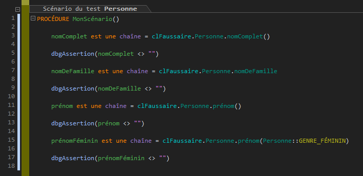
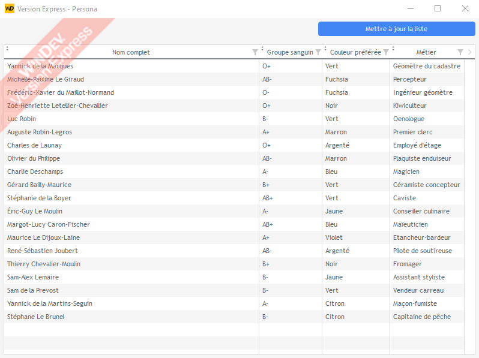

# Le faussaire


> Ce composant n'est pas un produit officiel WINDEV®. Les marques "PC SOFT" et "WINDEV" sont des marques déposées de la société PC SOFT.

Le Faussaire est un composant WINDEV® utile pour générer des données (noms, prénoms, IBAN, etc...) pour remplir vos applications pendant les phases de développement et de test. Vous pouvez également l'utiliser pour faire des tests de resistance au stress de vos applications.

Le composant est largement inspiré du package [fzaninotto/Faker](https://github.com/fzaninotto/Faker).

## Comment l'utiliser ?

1. Téléchargez la dernière version du composant (Faussaire.zip) dans la [page de Releases de ce projet](https://github.com/TeddyBear06/windev-faussaire/releases)
2. Ajoutez le composant à votre projet WINDEV® [documentation officielle](https://doc.pcsoft.fr/?2014006)
3. Vous instanciez un Faussaire et voilà !

Exemple :

```
clFaussaire est CFaussaire

POUR nIndex = 1 À 10000
	TABLE_Clients.AjouteLigne(clFaussaire.Prénom(CFaussaire::GENRE_FÉMININ), clFaussaire.NomDeFamille())
FIN
```

La capture ci-dessous vous présente quelques utilisations possibles :




## Pourquoi le "Faussaire" ?

Je voulais rester dans - ma compréhension de - l'esprit WINDEV® en ce qui concerne la francisation et donner une identité forte à ce projet.

## Compatibilité

Le composant est généré avec WINDEV® Express 26 (je n'ai pas de licence WINDEV®... À bon entendeur :-)). 

Si vous utilisez une version commerciale de WINDEV®, vous devrez récupérer le code de ce composant et le générer à nouveau avec votre WINDEV® commercial.

## Logo

Merci à [OpenClipart-Vectors](https://pixabay.com/vectors/comedy-funny-glasses-mask-carnival-156776/)
