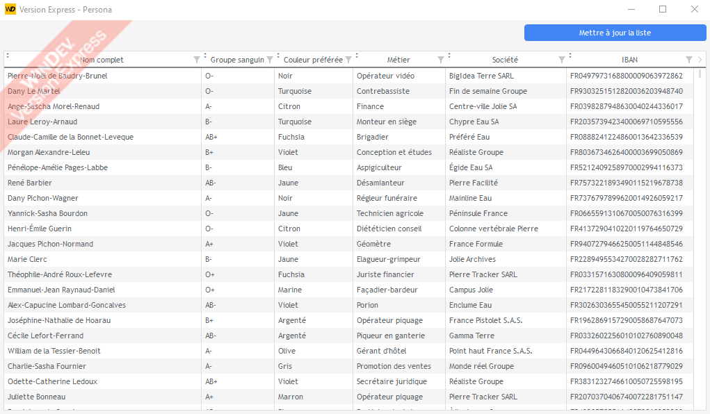

# Le Faussaire


> Ce composant n'est pas un produit officiel WINDEV®. Les marques "PC SOFT" et "WINDEV" sont des marques déposées de la société PC SOFT.

Le Faussaire est un composant WINDEV® utile pour générer des données (noms, prénoms, IBAN, etc...) pour remplir vos applications pendant les phases de développement et de test. Vous pouvez également l'utiliser pour faire des tests de résistance au stress de vos applications.

Le composant est - très - largement inspiré du package [fzaninotto/Faker](https://github.com/fzaninotto/Faker) que j'adore et que j'utilise depuis des années.

## Comment l'utiliser ?

1. Téléchargez la dernière version du composant (Faussaire.zip) dans la [page de Releases de ce projet](https://github.com/TeddyBear06/windev-faussaire/releases)
2. Ajoutez le composant à votre projet WINDEV® [documentation officielle](https://doc.pcsoft.fr/?2014006)
3. Vous instanciez un Faussaire et voilà !

Exemple (pour générer des [personas](https://fr.wikipedia.org/wiki/Persona)) :

```
clFaussaire est un Faussaire

stPersonne est une Structure
	nomComplet est une chaîne
	groupeSanguin est une chaîne
	couleurPréférée est une chaîne
	métierPratiqué est une chaîne
FIN

POUR i = 1 À 20

	personneGénérée est une stPersonne

	personneGénérée.nomComplet = clFaussaire.Personne.nomComplet("", Faux)
	personneGénérée.groupeSanguin = clFaussaire.Sang.groupeSanguin()
	personneGénérée.couleurPréférée = clFaussaire.Couleur.couleur(Faux)
	personneGénérée.métierPratiqué = clFaussaire.Entreprise.métier

	tabListePersonnes.Ajoute(personneGénérée)

FIN
```

La capture ci-dessous vous présente une utilisation possible (mais la limite, c'est votre imagination) :



## Pourquoi le "Faussaire" ?

Je voulais rester dans - ma compréhension de - l'esprit WINDEV® en ce qui concerne la francisation et donner une identité forte à ce projet.

## Compatibilité

Le composant est généré avec WINDEV® Express 28 (je n'ai pas de licence WINDEV®... À bon entendeur :-)). 

Si vous utilisez une version commerciale de WINDEV®, vous devrez récupérer le code de ce composant et le générer à nouveau avec votre WINDEV® commercial.

## Soutien

La réalisation de ce composant représente de nombreuses heures de travail (sur mon temps libre). Si vous, ou votre organisation, apprécie mon travail, n'hésitez pas à considérer le fait d'acheter (contribution libre entre 5€ et 495€, il suffit d'ajuster la quantité en fonction de vos moyens) ce composant sur mon lien de paiement Stripe [LFConsult (lien Stripe)](https://buy.stripe.com/9AQ5n5fOuc4n9Q4bIJ), votre nom (ou pseudo ou ce que vous souhaitez) sera affiché sur la liste des sponsors !

## Contributions

Les contributions sont les bienvenues du moment qu'elles respectent l'esprit du projet.

## Logo

Merci à [OpenClipart-Vectors](https://pixabay.com/vectors/comedy-funny-glasses-mask-carnival-156776/)
